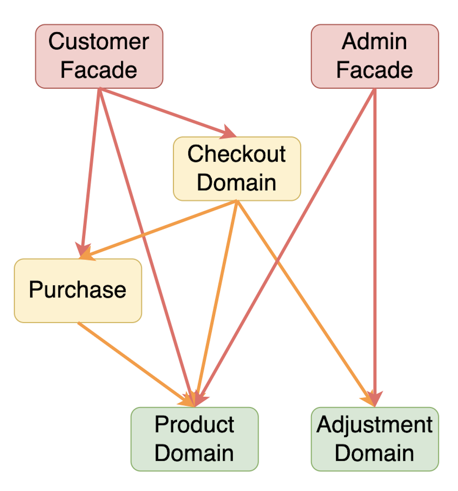

# Electronic Store

## App Start Command

`mvn spring-boot:run`

Swagger web ui console can be accessed below:

http://localhost:8080/swagger-ui/index.html#/

## Test Start Command

`mvn clean test`

## User Guidelines

`Product` is not directly visible to customer if it is not on shelf. Admin can `launch product` to put product to the
shelf.
(If *price* is also provided when creating product, product will be *auto launched*.)
Customer will then be able to put the `good`(a.k.a. on-sale product) to the `basket`.

`Product` on the shelf cannot be deleted by admin directly by default. It is needed to first `discontinue` the product
to remove it from the shelf, then delete the product permanently.
(Admin can also leverage `auto-discontinue` flag to auto discontinue when trying to delete product)

`Discount` setting can be configured to be applicable to all product by using `isApplyToAllProduct=true`, or target a
on-sale product by setting `shelfGoodId`.
`applyAtEveryNthNumberOfIdenticalItem` setting is used to indicate how many number of *identical product* needed in
order to get discount.

## Architecture

### Design Rationale

1. In order to earn benefits from SOLID Principle, clean architecture is applied.

2. This is also an Evolutionary Design, which is flexible to be evolved to microservice architecture from current
   modular monolith.

3. Because future proof for runtime decoupling is taken into consideration, hexagonal architecture is used. Cross
   domain( microservice) communication is delegated to the `Port layer`( XXXDomainApi) to handle.

4. Spring Data is already doing a very good abstraction layer. In order to simply code structure, repository is not
   needed to be defined in the `Port layer`.

5. `API layer` in domain is the publicly accessible interface. Each API interface could possibly be evolved to a web
   controller when splitting microservices.

6. Facade pattern is currently used. Remote Facade (API Composition) can be easily adopted when splitting microservices.

7. In order to mitigate potential data corruption issue in multi-threaded environment, `DB Transaction` is used. Because
   microservice architecture is the long run, Transaction only start in domain's `Usecase layer`.

Side note:

`Id` attribute is defined as `String` in all DTO because of below reason:

In DDD(Domain Drive Design) world, bounded context and autonomy are the soul. It's very important to "hide" the internal
architecture / tech stack, in order to retain the freedom of choice.

In order to ensure context root of endpoints providing to customer and admin are separated, ArchUnit is used in
ArchitectureTest. It's also feasible to add more architecture test cases to protect architecture decisions being made by
adding more test cases in CI/CD.

### Dependency Diagram

